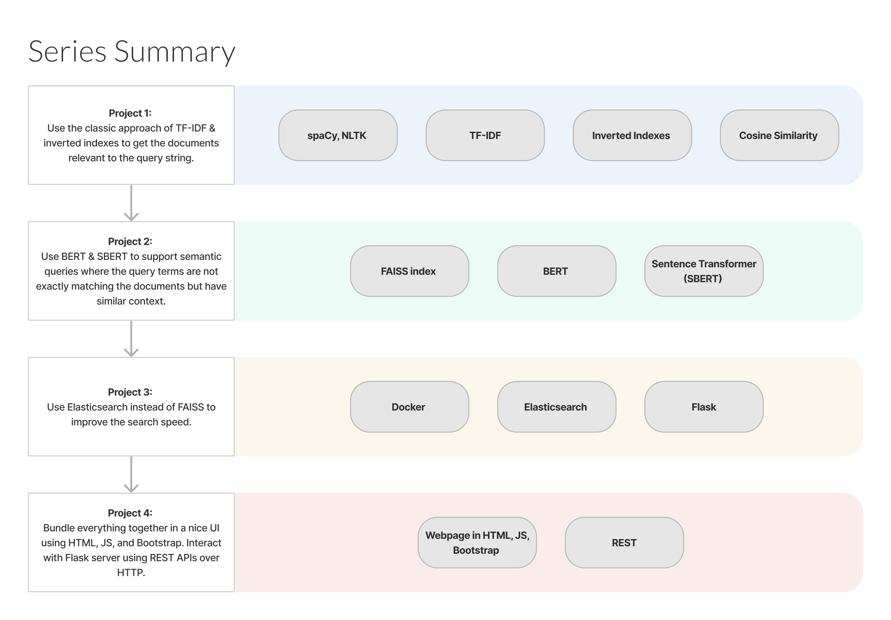

# Live Project: Search Tool with NLP

In this liveProject, you are a data scientist at the Centers for Disease Control and Prevention (CDC). You will take a
critical part in the development of a new plan to prevent, control, and respond to future pandemics; launched by the
Department of Health and Human Services. Your goal is to build an efficient and smart search engine for fast access to
the CDC’s document database. To do this, you need to research and develop strategies to aggregate and quickly search
historical and likely unstructured text data about earlier pandemics, so that they can be easily accessed when needed.

## Techniques employed

In this liveProject, we will implement a simple but very effective document search method called TF-IDF. TF-IDF stands
for term frequency-inverse document frequency. It may sound fancy, but it simply means that we are going to count the
words in each document and calculate how often they occur.

- Use Python’s built-in JSON library to store multi-level text data.
- Create, update and transform lists and dictionaries with text data.
- Apply Python’s spaCy library to perform essential Natural Language Processing steps to tokenize, clean, and lemmatize
  the texts.
- Compute TF-IDF tables for the provided Wikipedia articles and apply term frequency search to them.
- Calculate cosine similarity with scikit-learn.
- Build an inverted index, an essential element of a search engine. Compare the number of code lines you need to search
  within the inverted index compared and to the term frequency (TF-IDF) search.

This project is intended for Python developers, data scientists, engineers, and curious Python practitioners who want to
learn the inner workings of modern full-text search technology.

## Series Summary

